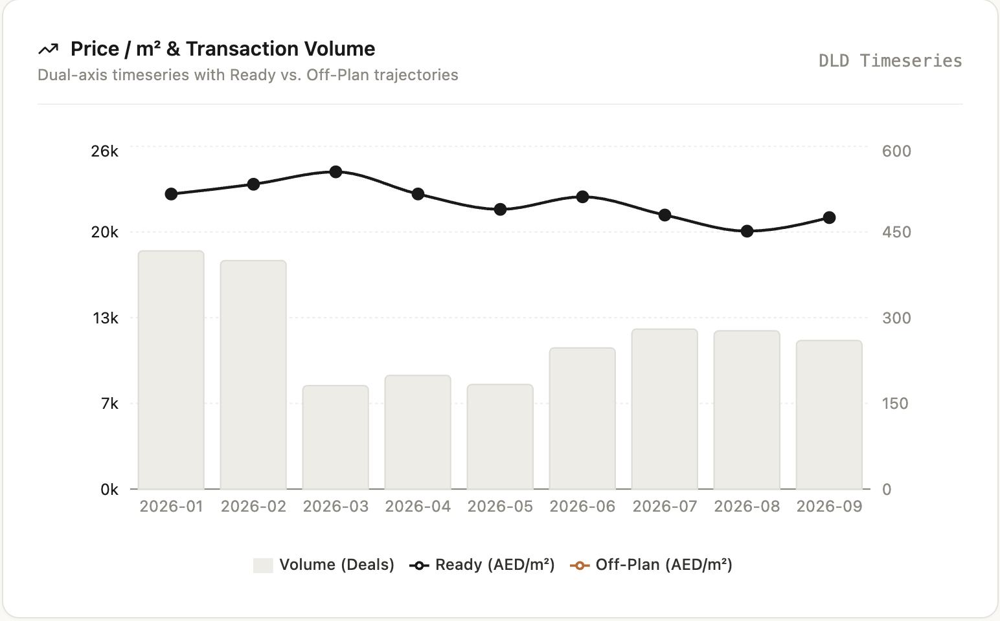
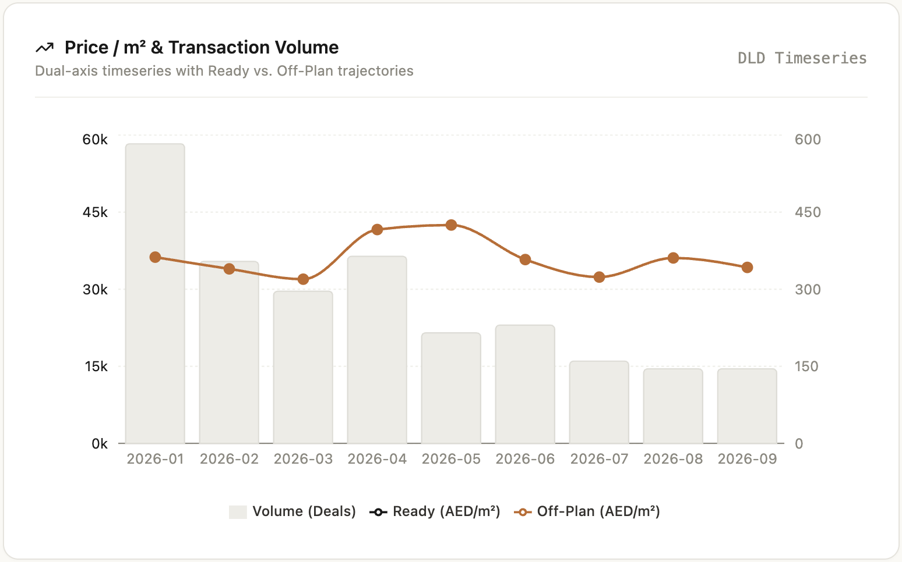
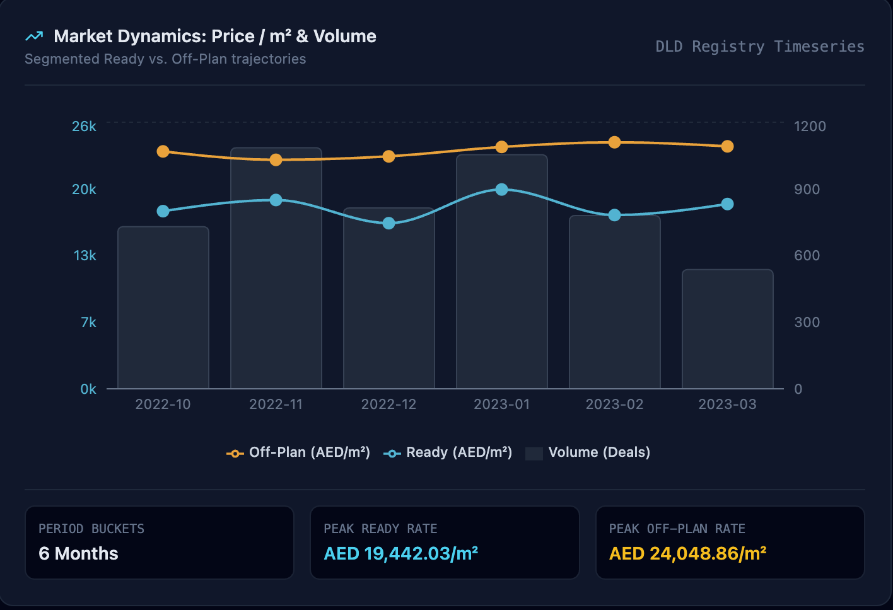

# AcreIQ

### Verifiable Financial Intelligence for Dubai Real Estate

[](https://acreiq.vercel.app/)
[](https://acreiq-api-zv7ueef3fq-ww.a.run.app/docs)
[](https://www.python.org/)
[](https://react.dev/)
[](https://vite.dev/)
[](https://tailwindcss.com/)
[](https://recharts.org/)
[](https://fastapi.tiangolo.com/)
[](https://duckdb.org/)
[](https://cloud.google.com/)

**AcreIQ** is a full-stack analytical intelligence terminal and production API for performing verifiable financial analysis over official **Dubai Land Department (DLD)** real-estate transaction data.

The current system combines an interactive **React/Vite analytical terminal**, a headless **Model Context Protocol (MCP) interface** for agentic clients, and a production **FastAPI REST API** backed by deterministic DuckDB analytics.

The system is designed around a simple principle:

> **LLMs may explain financial data. They do not get to define the financial truth.**

Rather than relying on Vector RAG to retrieve and synthesize numerical information, AcreIQ executes deterministic SQL aggregation over transaction records using **DuckDB**, resolves natural-language locations against legal cadastral entities, separates transaction segments where required, and subjects generated responses to a programmatic **Auditor Gate** before they are returned.

The result is an analytical system where market figures are derived from transaction-level ground truth, visualized through an institutional-style terminal, and traced back to underlying DLD registry records.


---

## Architecture

```text
                         ┌──────────────────────────────────────┐
                         │          CLIENT INTERFACES           │
                         └──────────────────┬───────────────────┘
                                            │
                    ┌───────────────────────┼────────────────────────┐
                    │                       │                        │
                    ▼                       ▼                        ▼
        ┌────────────────────┐  ┌────────────────────┐  ┌────────────────────┐
        │ Interactive        │  │ Headless MCP       │  │ Direct REST API    │
        │ React / Vite       │  │ Server             │  │ FastAPI            │
        │ Analytical         │  │ src/mcp_server.py  │  │ Google Cloud Run   │
        │ Terminal           │  │                    │  │ me-central1        │
        │                    │  │ Claude Desktop /   │  │                    │
        │ Vercel             │  │ Agentic Clients    │  │ /v1/chat           │
        └─────────┬──────────┘  └─────────┬──────────┘  └─────────┬──────────┘
                  │                       │                       │
                  └───────────────────────┼───────────────────────┘
                                          │
                                          ▼
                              ┌──────────────────────┐
                              │   Cadastral Entity   │
                              │      Resolution      │
                              │                      │
                              │ "Downtown Dubai"     │
                              │         ↓            │
                              │ "burj khalifa"       │
                              └──────────┬───────────┘
                                         │
                                         ▼
                        ┌────────────────────────────────┐
                        │         DuckDB Engine          │
                        │                                │
                        │  In-memory deterministic SQL   │
                        │  ─ Median                      │
                        │  ─ Mean                        │
                        │  ─ Transaction volume          │
                        │  ─ Average price / m²          │
                        │  ─ Monthly timeseries          │
                        │  ─ Ready / Off-Plan segments   │
                        │  ─ Source transaction records  │
                        └────────────────┬───────────────┘
                                         │
                                         ▼
                              ┌──────────────────────┐
                              │   Groq / LLaMA 3.3   │
                              │  Primary Synthesizer │
                              │                      │
                              │  Human-readable      │
                              │  market intelligence │
                              └──────────┬───────────┘
                                         │
                                         ▼
                        ┌────────────────────────────────┐
                        │         AUDITOR GATE           │
                        │                                │
                        │  Programmatic verification     │
                        │  against raw DuckDB results    │
                        │                                │
                        │  ✓ Numerical consistency       │
                        │  ✓ Grounding status            │
                        │  ✓ Cadastral consistency       │
                        │  ✓ Registry provenance         │
                        └────────────────┬───────────────┘
                                         │
                            ┌────────────┴────────────┐
                            │                         │
                     VERIFIED RESPONSE         REJECT / CIRCUIT
                            │                         │
                            ▼                         ▼
                   Grounded market brief      is_grounded: false
                   + verified DLD IDs         + discrepancy log
```

The architecture deliberately separates **client experience**, **deterministic financial computation**, **LLM synthesis**, and **verification**.

---

# Why AcreIQ?

Financial questions are particularly susceptible to hallucination.

A conventional RAG architecture can retrieve relevant documents but still allow an LLM to:

* Invent transaction values
* Calculate incorrect averages
* Conflate neighboring communities
* Treat colloquial names as legal entities
* Fabricate supporting records
* Produce plausible figures when no underlying transactions exist
* Blend materially different transaction types into a misleading statistic

AcreIQ separates **computation** from **language generation**.

| Responsibility             | System                                        |
| -------------------------- | --------------------------------------------- |
| Interactive analytics      | React / Vite terminal                         |
| Entity resolution          | Deterministic cadastral lookup                |
| Numerical computation      | DuckDB SQL                                    |
| Transaction selection      | DLD source records                            |
| Market segmentation        | Deterministic Ready / Off-Plan classification |
| Timeseries computation     | DuckDB monthly aggregation                    |
| Visualization              | Recharts                                      |
| Natural-language synthesis | Groq / LLaMA 3.3                              |
| Numerical verification     | Deterministic Auditor Gate                    |
| Agentic tool interface     | MCP                                           |
| Provenance                 | DLD registry record IDs                       |
| Invalid-query handling     | Fast-path circuit breaker                     |

The LLM is therefore a **synthesis layer**, not the source of numerical truth.

---

# Core Capabilities

## 1. Deterministic In-Memory Analytics

AcreIQ loads the DLD transaction dataset into container memory and uses DuckDB for analytical execution.

Queries calculate metrics directly from transaction records, including:

* Median transaction price
* Mean transaction price
* Transaction volume
* Average price per square metre
* Monthly transaction volume
* Monthly average price/m²
* Underlying transaction records
* Registry identifiers

This avoids asking a generative model to perform financial arithmetic or infer statistics from retrieved text.

---

## 2. Cadastral Entity Resolution

Real-estate users rarely use legal cadastral terminology.

For example:

```text
User Query

    │

    ▼

"Show me the market in Downtown Dubai"

    │

    ▼

Cadastral Resolution

    │

    ▼

"burj khalifa"

    │

    ▼

DLD Transactions
```

AcreIQ resolves colloquial community names to the corresponding legal/master-community cadastral key before analytical execution.

This prevents geographically ambiguous natural-language queries from silently producing incorrect transaction sets.

---

## 3. Segmented Market Dynamics

AcreIQ explicitly distinguishes between **Ready** and **Off-Plan** transaction activity.

This distinction is important because the two categories represent materially different market mechanisms:

* **Existing Properties / Ready** — secondary-market transactions involving completed properties.
* **Off-Plan Properties** — development contracts originating from off-plan sales.

Combining these transactions into a single statistic can distort the observed market distribution, particularly when one segment has materially different pricing or transaction volume characteristics.

AcreIQ therefore allows the analytical layer to decouple these segments before calculating market statistics.

| Ready Properties (Secondary Resale) | Off-Plan Properties (Development Contracts) |
| :---: | :---: |
|  |  |
| *14-month historical trajectory showing Ready prices peaking at AED 19,603/m²* | *9-month construction trajectory showing Off-Plan peaking at AED 24,048/m²* |

The terminal exposes these segments as explicit market-type filters rather than hiding them inside a single aggregate.

---

## 4. Dual-Axis Market Timeseries

AcreIQ extends point-in-time metrics into a multi-month analytical timeseries. 

The terminal plots transaction volume distributions along the secondary axis concurrently with isolated Ready and Off-Plan price/m² trajectories on the primary axis:



The visualization combines:

1. **Monthly transaction volume bars**
2. **Ready average price/m² trajectory**
3. **Off-Plan average price/m² trajectory**

This allows analysts to evaluate liquidity surges (volume bars) alongside price per square meter shifts without masking developer premiums or secondary market movements.

The underlying values are computed from the analytical dataset rather than generated by the LLM.

---

## 5. Interactive Market Filtering

The terminal provides rapid filtering over the analytical timeseries.

### Duration filters

* **3M** — recent three-month window
* **6M** — recent six-month window
* **1Y** — recent one-year window
* **All Time** — full available dataset period

These filters can be driven through the interactive terminal as well as interpreted from natural-language analytical requests.

### Market-type filters

Users can toggle between:

* **All**
* **Ready**
* **Off-Plan**

This allows the same underlying analytical model to answer both aggregate and segment-specific market questions without requiring separate datasets or manually reconstructed queries.

---

## 6. Dual-Agent Synthesis + Auditor Gate

AcreIQ separates generation from verification.

### Primary Synthesizer

The Groq-hosted LLaMA 3.3 model receives the verified analytical slice and produces a human-readable market brief.

Its role is to:

* Interpret computed statistics
* Explain market characteristics
* Produce readable financial summaries
* Surface relevant transaction evidence
* Explain observed market dynamics

### Deterministic Auditor Gate

The generated response is then checked programmatically against the authoritative DuckDB execution result.

The Auditor Gate verifies that numerical claims correspond to the underlying analytical slice.

Conceptually:

```text
DuckDB Ground Truth

        │

        ├── median = 2,635,000

        ├── mean   = 3,797,000

        └── avg/m² = 29,292.58

                  │

                  ▼

          Generated Response

                  │

                  ▼

            Auditor Gate

                  │

          ┌───────┴───────┐
          │               │
       MATCH           MISMATCH
          │               │
          ▼               ▼
     Grounded=True    Reject / Flag
```

A response is not considered grounded merely because the LLM produced a plausible answer.

---

## 7. Traceable DLD Provenance

AcreIQ surfaces exact DLD registry record identifiers associated with analytical results.

Example:

```text
1-102-2023-13201

1-11-2023-7742

...
```

This creates a direct provenance path:

```text
Natural-language query

        ↓

Cadastral entity

        ↓

SQL aggregation

        ↓

Transaction slice

        ↓

DLD registry IDs

        ↓

Generated explanation
```

The system therefore provides an audit trail rather than an opaque generated number.

---

## 8. Adversarial Query Rejection

AcreIQ explicitly handles queries for entities that do not exist in the underlying DLD data.

For example:

```text
"Analyse Winterfell High Street"
```

does not result in the model attempting to fabricate a market.

Instead, the request is terminated through a fast-path circuit breaker:

```json
{
  "is_grounded": false,
  "discrepancies": [
    "NO_RECORDS_FOUND: NO_TOOL_CALL_MADE — no verified DLD transactions to ground against."
  ]
}
```

This is an intentional failure mode.

**No data is preferable to fabricated financial intelligence.**

---

# Production Benchmark

The following results are from the project's evaluation runs against the production deployment.

| Scenario                   | Cadastral Resolution         | Analytical Output                                                                | Grounded                 |         Latency |
| -------------------------- | ---------------------------- | -------------------------------------------------------------------------------- | ------------------------ | --------------: |
| **Downtown Dubai**         | `burj khalifa`               | 500 records; Median **AED 2.635M**; Avg **AED 3.797M**; Avg **AED 29,292.58/m²** | `true` — 0 discrepancies |     ~13.6s cold |
| **Palm Jumeirah**          | `palm jumeirah`              | 500 records; Median **AED 3.425M**; Avg **AED 6.868M**; Avg **AED 27,956.18/m²** | `true`                   |      ~5.9s warm |
| **Winterfell High Street** | No verified cadastral entity | No transaction ground truth                                                      | `false`                  | ~1.8s fast-path |

### Warm Production Performance

With the analytical dataset already resident in the Cloud Run container, the current architecture targets **sub-3.5-second warm round trips** for supported analytical queries, while maintaining:

* **0 discrepancies** on verified benchmark responses
* Deterministic DuckDB computation
* Auditor Gate validation
* Full DLD registry-record provenance

Cold-start requests remain materially slower because the analytical dataset must first be loaded into container memory.

### Observed Financial Signal

The Palm Jumeirah benchmark demonstrates why reporting multiple statistics matters.

```text
Median:     AED 3.425M

Mean:       AED 6.868M
```

The large difference between the median and mean reflects the influence of high-value transactions, consistent with the project's observed **luxury-villa skew**.

AcreIQ therefore exposes both statistics rather than collapsing the market into a single generated "average price."

### Verified Provenance

Successful queries return DLD registry IDs, including examples such as:

```text
1-102-2023-13201

1-11-2023-7742

...
```

---

# Production API

**Live Swagger / OpenAPI documentation:**

https://acreiq-api-zv7ueef3fq-ww.a.run.app/docs

Primary endpoint:

```text
POST /v1/chat
```

## Example: Grounded Query

```bash
curl -X POST \
  "https://acreiq-api-zv7ueef3fq-ww.a.run.app/v1/chat" \
  -H "Content-Type: application/json" \
  -d '{
    "query": "Analyse the real estate market in Downtown Dubai"
  }'
```

A successful response is grounded against the resolved DLD cadastral entity and includes deterministic analytical values and transaction provenance.

Representative analytical output:

```text
Cadastral: burj khalifa

Records analysed: 500

Median price: AED 2.635M

Average price: AED 3.797M

Average price/m²: AED 29,292.58

Grounded: true

Discrepancies: 0
```

## Example: Adversarial Probe

```bash
curl -X POST \
  "https://acreiq-api-zv7ueef3fq-ww.a.run.app/v1/chat" \
  -H "Content-Type: application/json" \
  -d '{
    "query": "Analyse property prices on Winterfell High Street"
  }'
```

Expected grounding behavior:

```json
{
  "is_grounded": false,
  "discrepancies": [
    "NO_RECORDS_FOUND: NO_TOOL_CALL_MADE — no verified DLD transactions to ground against."
  ]
}
```

The system rejects the query instead of generating unsupported financial figures.

---

# REST Request Lifecycle

A typical production request follows this sequence:

```text
POST /v1/chat

      │

      ▼

FastAPI validation

      │

      ▼

Cadastral entity resolution

      │

      ▼

DuckDB analytical query

      │

      ├── Transaction count

      ├── Median

      ├── Mean

      ├── Average price/m²

      ├── Monthly timeseries

      ├── Ready / Off-Plan segmentation

      └── DLD registry IDs

      │

      ▼

Groq / LLaMA 3.3 synthesis

      │

      ▼

Auditor Gate

      │

      ├── Numerical verification

      ├── Grounding verification

      └── Provenance verification

      │

      ▼

Verified API response
```

For unsupported entities:

```text
POST /v1/chat

      │

      ▼

Cadastral resolution

      │

      ▼

No verified records

      │

      ▼

Fast-Path Circuit Breaker

      │

      ▼

is_grounded: false
```

---

# Client Interfaces

AcreIQ is no longer limited to direct API consumption. The analytical engine is exposed through three complementary interfaces.

| Interface            | Technology                         | Purpose                              | Deployment          |
| -------------------- | ---------------------------------- | ------------------------------------ | ------------------- |
| Interactive Terminal | React / Vite / Tailwind / Recharts | Human-facing analytical dashboard    | Vercel              |
| MCP Server           | Model Context Protocol             | Agentic / headless analytical access | `src/mcp_server.py` |
| REST API             | FastAPI                            | Programmatic integration             | Google Cloud Run    |

### Interactive Terminal

The React/Vite frontend provides an institutional-style analytical interface for:

* Natural-language market queries
* Market segmentation
* Duration filtering
* Ready / Off-Plan toggling
* Monthly transaction volume analysis
* Average price/m² timeseries
* Grounding and provenance visibility

### MCP Interface

`src/mcp_server.py` exposes AcreIQ's analytical capabilities to MCP-compatible agentic clients.

This allows clients such as Claude Desktop to interact with the same deterministic analytical layer without bypassing the underlying grounding architecture.

### REST Interface

The FastAPI service remains the direct machine-to-machine interface.

This provides a stable API surface for applications, automated workflows, and external agent systems.

---

# Cloud Architecture

AcreIQ is deployed serverlessly on **Google Cloud Run** in:

```text
me-central1
```

The production architecture separates the Vercel-hosted client from the analytical backend:

```text
                         Users / Agents
                               │
              ┌────────────────┼────────────────┐
              │                │                │
              ▼                ▼                ▼
       React / Vite          MCP             REST
          Vercel           Clients          Clients
              │                │                │
              └────────────────┼────────────────┘
                               │
                               ▼
                     Google Cloud Run
                         me-central1
                               │
                    ┌──────────┴──────────┐
                    │                     │
                    ▼                     ▼
             AcreIQ Container       Secret Manager
                    │                     │
                    │                GROQ_API_KEY
                    │
                    ▼
                DuckDB RAM
                    │
                    ▼
              DLD Transactions
```

The deployment is designed for low idle cost while retaining bounded production capacity.

### Runtime Configuration

| Configuration       |                       Value |
| ------------------- | --------------------------: |
| Region              |               `me-central1` |
| Minimum instances   |                         `0` |
| Maximum instances   |                         `5` |
| Request timeout     |                       `60s` |
| Container execution |                    Non-root |
| Secrets             | Google Cloud Secret Manager |
| LLM provider        |                        Groq |
| Analytical engine   |                      DuckDB |
| Frontend            |                      Vercel |
| Frontend framework  |                React / Vite |

### Scale-to-Zero

Cloud Run is configured with:

```text
--min-instances=0
```

This provides **$0 idle compute cost** when no instances are running.

The trade-off is cold-start latency: the first request can take approximately **10–13 seconds**, primarily due to loading the analytical dataset into container memory.

Warm requests target **sub-3.5-second round trips** for supported analytical workloads once the container is warm.

---

# Security

The production backend follows several baseline security practices:

* Runs as a **non-root user**
* Uses multi-stage Docker builds
* Keeps API credentials outside the image
* Injects `GROQ_API_KEY` dynamically through **Google Cloud Secret Manager**
* Limits Cloud Run concurrency through bounded instance configuration
* Uses strict Pydantic request/response schemas
* Separates the public client from backend credentials

Secrets should never be committed to the repository or baked into Docker layers.

The frontend does not contain the Groq API credential or other backend secrets.

---

# Data Architecture

AcreIQ operates over approximately **600 MB of raw Dubai Land Department transaction data covering the 2023 calendar year**.

The analytical path is intentionally simple:

```text
DLD Source Data
      │
      ▼
Transaction Records
      │
      ▼
Container Memory
      │
      ▼
DuckDB
      │
      ├── Cadastral filtering
      │
      ├── Ready / Off-Plan segmentation
      │
      ├── Monthly aggregation
      │
      ├── Statistical computation
      │
      └── Provenance extraction
```

DuckDB provides an embedded analytical database without requiring a separate database service for the transactional analytical workload.

This keeps the architecture lightweight while allowing SQL-based analytical operations over the complete in-memory dataset.

---

# Data Scope & Limitations

The current AcreIQ deployment uses a Dubai Land Department open transaction dataset covering the **2023 calendar year**.

Accordingly:

* All analytical results are based on 2023 transactions only.
* Reported transaction volumes represent records available in the 2023 dataset, not total historical DLD activity.
* Median, mean, and price/m² statistics describe the 2023 observed transaction sample.
* Timeseries visualizations operate within the temporal coverage of the available dataset.
* The current system does not provide a continuous multi-year historical market series.
* Results should not be interpreted as representing current 2026 market conditions.
* Queries concerning post-2023 conditions are outside the temporal coverage of the underlying dataset.

The analytical architecture can support additional temporal data as the underlying source dataset is expanded, but the current deployment should be understood strictly within its available source-data coverage.

### Dataset Coverage

| Attribute           | Coverage                        |
| ------------------- | ------------------------------- |
| Source              | Dubai Land Department           |
| Dataset type        | Real-estate transaction records |
| Geographic scope    | Dubai, UAE                      |
| Temporal scope      | **2023 calendar year**          |
| Raw dataset size    | ~600 MB                         |
| Analytical engine   | DuckDB                          |
| Storage model       | In-memory                       |
| Market segmentation | Ready / Off-Plan                |

---

# Repository Structure

```text
.
├── src/
│   ├── agents.py              # Dual-agent synthesis & grounding logic
│   ├── api.py                 # FastAPI REST endpoints
│   ├── config.py              # Environment settings
│   ├── db.py                  # DuckDB connection & query execution
│   ├── mcp_server.py          # Model Context Protocol / tool server
│   ├── schemas.py             # Strict Pydantic I/O models
│   └── tools.py               # Cadastral lookup & data extraction
│
├── web/
│   ├── src/
│   │   ├── App.tsx            # Main analytical terminal
│   │   └── types.ts           # Frontend data and API types
│   ├── package.json           # Frontend dependencies & scripts
│   ├── index.html             # Vite application entry
│   └── ...
│
├── tests/
│   ├── eval_runner.py         # Evaluation test runner
│   └── golden_eval_set.json   # Test fixtures & edge cases
│
├── Dockerfile                 # Multi-stage non-root backend container
├── cloudbuild.yaml            # GCP Cloud Build CI/CD specification
├── requirements.txt           # Python dependencies
└── ...
```

---

# Local Development

## Prerequisites

* Python 3.11+
* Node.js / npm
* Docker
* Access to the 2023 DLD transaction dataset
* Groq API key for LLM synthesis

---

## Backend — Python Virtual Environment

Clone the repository:

```bash
git clone <repository-url>

cd AcreIQ
```

Create and activate a virtual environment.

### macOS / Linux

```bash
python3.11 -m venv .venv

source .venv/bin/activate
```

### Windows

```powershell
py -3.11 -m venv .venv

.venv\Scripts\activate
```

Install dependencies:

```bash
pip install -r requirements.txt
```

Configure environment variables:

```bash
export GROQ_API_KEY="your-api-key"
```

Start the API:

```bash
uvicorn src.api:app --reload
```

The API will be available at:

```text
http://localhost:8000
```

Swagger documentation:

```text
http://localhost:8000/docs
```

---

## Frontend — React / Vite

From the repository root:

```bash
cd web
```

Install frontend dependencies:

```bash
npm install
```

Start the Vite development server:

```bash
npm run dev
```

The frontend will be available at the local Vite URL shown in the terminal, typically:

```text
http://localhost:5173
```

The frontend communicates with the AcreIQ backend API and provides the interactive analytical terminal.

---

## Option 2 — Docker

Build the production image:

```bash
docker build -t acreiq .
```

Run the container:

```bash
docker run \
  -p 8000:8000 \
  -e GROQ_API_KEY="your-api-key" \
  acreiq
```

Access the API:

```text
http://localhost:8000/docs
```

The Dockerfile uses a multi-stage build and executes the application as a non-root user.

---

# Evaluation

The repository contains a dedicated evaluation harness:

```text
tests/

├── eval_runner.py

└── golden_eval_set.json
```

The evaluation set covers both normal analytical queries and adversarial conditions.

Key evaluation dimensions include:

1. Cadastral resolution
2. Transaction retrieval
3. Numerical correctness
4. Market segmentation
5. Timeseries correctness
6. Grounding status
7. Provenance extraction
8. Adversarial rejection
9. Fast-path behavior

The important distinction is that **LLM fluency is not treated as evaluation success**.

A successful test requires the generated financial intelligence to remain consistent with deterministic analytical ground truth.

---

# Design Principles

### 1. Compute Before You Generate

Financial statistics are calculated by DuckDB rather than inferred by the language model.

### 2. Resolve Entities Before Querying

Natural-language geography is mapped to legal cadastral identifiers before transaction aggregation.

### 3. Segment Before Aggregating

Ready and Off-Plan transactions are analytically separated where combining them would distort market statistics.

### 4. Verify After Generation

The generated response passes through a deterministic Auditor Gate before being considered grounded.

### 5. Preserve Provenance

Analytical claims retain references to underlying DLD registry records.

### 6. Fail Closed

When there is no verified source data, AcreIQ does not manufacture an answer.

### 7. Separate Interfaces from Ground Truth

The React terminal, MCP clients, and REST API are interfaces to the same deterministic analytical engine. None of them become an alternative source of financial truth.

### 8. Optimize for Production Constraints

The architecture deliberately balances:

* Analytical correctness
* LLM flexibility
* Warm-query latency
* Cold-start latency
* Infrastructure cost
* Container security
* Operational simplicity

---

# Technology Stack

| Layer               | Technology                              |
| ------------------- | --------------------------------------- |
| Frontend            | React                                   |
| Frontend Build Tool | Vite                                    |
| Styling             | Tailwind CSS                            |
| Data Visualization  | Recharts                                |
| API                 | FastAPI                                 |
| Language            | Python 3.11+                            |
| Analytical Database | DuckDB                                  |
| LLM                 | Groq / LLaMA 3.3                        |
| Data Validation     | Pydantic                                |
| Tool Interface      | MCP                                     |
| Containerization    | Docker                                  |
| Frontend Hosting    | Vercel                                  |
| Backend Runtime     | Google Cloud Run                        |
| CI/CD               | Google Cloud Build                      |
| Secrets             | Google Cloud Secret Manager             |
| Source Data         | Dubai Land Department 2023 transactions |

---

# Production Characteristics

```text
                 AcreIQ Reliability Model

       ┌─────────────────────────────────────┐
       │       DLD Transaction Ground Truth   │
       └──────────────────┬──────────────────┘
                          │
                          ▼
                  Deterministic SQL
                          │
                          ▼
              Segmented Analytical Results
                          │
                          ▼
                   LLM Synthesis
                          │
                          ▼
                   Auditor Gate
                          │
             ┌────────────┴────────────┐
             │                         │
           PASS                       FAIL
             │                         │
             ▼                         ▼
      Verified response         Explicit rejection
      + provenance              + discrepancy log
```

The architecture intentionally places the language model **between deterministic computation and deterministic verification**.

That separation is the core mechanism AcreIQ uses to reduce financial hallucination while retaining the usability of natural-language AI interfaces.

For verified warm requests, the production system targets **sub-3.5-second round trips with zero discrepancies**, while retaining transaction-level DLD provenance.

The system's reliability model is therefore based on three properties:

```text
Deterministic computation
        +
Programmatic verification
        +
Traceable source records
        =
Verifiable financial intelligence
```

---

# Live Deployment

### Interactive Analytical Terminal

https://acreiq.vercel.app/

### Swagger / OpenAPI

https://acreiq-api-zv7ueef3fq-ww.a.run.app/docs

### Primary API Route

```text
POST /v1/chat
```

### Deployment Region

```text
Google Cloud — me-central1
```

---

# Project Status

AcreIQ has transitioned from a backend analytical prototype into a **full-stack institutional analytical terminal** with:

* Interactive React/Vite dashboard
* Tailwind-based analytical interface
* Recharts market visualizations
* Ready / Off-Plan market segmentation
* Monthly transaction and price/m² timeseries
* Natural-language and UI duration filtering
* MCP support for agentic clients
* Production FastAPI REST API
* Deterministic DuckDB analytics
* LLM synthesis
* Auditor Gate verification
* DLD registry-record provenance
* Adversarial query rejection
* Serverless Cloud Run deployment
* Vercel frontend deployment

The current operating model is:

```text
Human / Agent Query
        │
        ▼
Interactive Terminal / MCP / REST
        │
        ▼
Deterministic cadastral resolution
        │
        ▼
Segment-aware DuckDB analysis
        │
        ▼
LLM explanation
        │
        ▼
Programmatic verification
        │
        ▼
Grounded response
        │
        ├── Financial figures
        ├── Market dynamics
        └── DLD registry provenance
```

Unsupported query:

```text
Query
  │
  ▼
No verified records
  │
  ▼
Circuit breaker
  │
  ▼
grounded: false
```

**The system treats financial ground truth as an invariant, not a generation target.**
