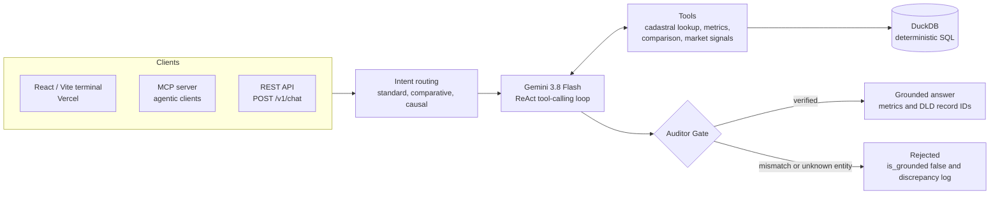
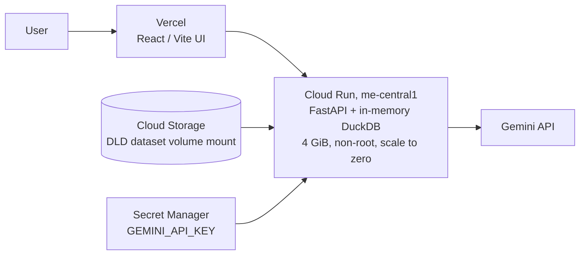

# AcreIQ

### Verifiable AI analytics for Dubai real estate

[](https://acreiq.vercel.app/)
[](https://acreiq-api-zv7ueef3fq-ww.a.run.app/docs)
[](https://www.python.org/)
[](https://fastapi.tiangolo.com/)
[](https://duckdb.org/)
[](https://react.dev/)

**AcreIQ** is an AI agent and analytics terminal that answers plain-English questions about **122,500+ Dubai Land Department (DLD) transactions** from 2026. It ships as a React terminal, a FastAPI REST API and an MCP server for agentic clients.

> **The LLM explains the data. It never defines it.**

Every figure is computed by deterministic SQL in DuckDB, and a programmatic **Auditor Gate** checks the AI's answer against the raw SQL output before it is returned. Instead of vector RAG, the agent retrieves facts through tool calls that run SQL.

**Try it:** [acreiq.vercel.app](https://acreiq.vercel.app/) (the first load can take a few seconds while the Cloud Run instance starts)


---

## Architecture



The model never does the arithmetic. Entity resolution, computation and verification are deterministic, and the LLM sits between them to explain results.

## Features

| Feature | What it does |
|---|---|
| **Deterministic analytics** | Median, mean, volume, price per m² and monthly timeseries computed in DuckDB, never by the model |
| **Cadastral entity resolution** | Maps everyday names to legal DLD community keys (for example "Downtown Dubai" to `burj khalifa`) so queries do not silently hit the wrong transactions |
| **Area comparison** | `compare_areas_metrics` returns a synchronized monthly series for two areas; the UI switches to a comparative chart automatically |
| **Ready vs Off-Plan segmentation** | Separates the two markets using DLD fields, so large off-plan contracts do not distort averages |
| **Market signals** | `get_market_signals` flags price surges and declines (±15% over the period) and volume spikes (1.5x the prior month) before the LLM interprets them |
| **Causal investigations** | "Why" and "Explain" questions run a separate path: observed signals first, then clearly labelled interpretations |
| **Auditor Gate** | Cross-checks every figure in the generated answer against the SQL results and rejects mismatches |
| **Provenance** | Returns DLD registry IDs (for example `41-14173-2026`) so each result traces back to source records |
| **Fail closed** | Unknown entities are rejected with `is_grounded: false` instead of producing invented numbers |


## Evaluation

An automated harness (`tests/eval_runner.py` with `golden_eval_set.json`) tests the full agent loop, not just the SQL.

| Metric | Result |
|---|---|
| Test categories | 8+, including adversarial, temporal and alias-resolution cases |
| Pass rate | 100% |
| Mean end-to-end latency | 6.91 s across multi-step agent loops |
| SQL execution | Sub-second (in-memory DuckDB) |

**Example (Business Bay, live):** 4,936 transactions, median AED 2,248,072.50, average AED 4,219,905.32, average AED 29,143.54 per m², with the Auditor Gate reporting 0 discrepancies.

**Adversarial probe:** a query for a street that does not exist in the data is rejected, not answered.

```json
{
  "is_grounded": false,
  "discrepancies": ["NO_RECORDS_FOUND: NO_TOOL_CALL_MADE - no verified DLD transactions to ground against."]
}
```

## API

```bash
curl -X POST "https://acreiq-api-zv7ueef3fq-ww.a.run.app/v1/chat" \
  -H "Content-Type: application/json" \
  -d '{"query": "Compare Business Bay and Al Furjan"}'
```

Interactive docs: [`/docs`](https://acreiq-api-zv7ueef3fq-ww.a.run.app/docs). Requests are routed to standard, comparative or causal analysis based on intent, and every response includes its grounding status.

## Deployment



- **Cloud Run** with 0 to 5 instances and a 60 s request timeout. Scale-to-zero means no idle compute cost, at the price of a slower first request while the dataset loads into memory.
- **Multi-stage, non-root Docker build** deployed through **Cloud Build**.
- **Secrets** stay out of the image and are injected from Secret Manager.
- **Strict Pydantic schemas** validate every request and response.

## Run locally

Prerequisites: Python 3.11+, Node.js, the DLD transaction dataset and a Gemini API key.

```bash
git clone <repository-url> && cd AcreIQ
python3.11 -m venv .venv && source .venv/bin/activate
pip install -r requirements.txt
export GEMINI_API_KEY="your-api-key"
uvicorn src.api:app --reload          # API at http://localhost:8000/docs
```

Frontend (separate terminal):

```bash
cd web && npm install && npm run dev  # http://localhost:5173
```

Or with Docker:

```bash
docker build -t acreiq . && docker run -p 8000:8000 -e GEMINI_API_KEY="your-api-key" acreiq
```

## Project structure

```text
src/
  agents.py       query routing, agent loop and grounding logic
  api.py          FastAPI endpoints
  db.py           DuckDB connection and query execution
  tools.py        cadastral lookup and analytical tools
  mcp_server.py   MCP tool server
  schemas.py      Pydantic models
web/              React / Vite terminal (Tailwind, Recharts)
tests/            eval_runner.py and golden_eval_set.json
Dockerfile        multi-stage non-root image
cloudbuild.yaml   Cloud Build CI/CD
```

## Tech stack

| Layer | Technology |
|---|---|
| Backend | Python, FastAPI, Pydantic, DuckDB |
| AI | Google Gemini 3.8 Flash, tool calling, MCP |
| Frontend | React, Vite, Tailwind CSS, Recharts |
| Infrastructure | Docker, Google Cloud Run, Cloud Build, Secret Manager, Vercel |
| Data | Dubai Land Department 2026 transactions |

## Design principles

1. **Compute before you generate.** SQL produces the numbers, the LLM explains them.
2. **Resolve entities first.** Everyday place names map to legal DLD keys before any query.
3. **Segment before aggregating.** Ready and Off-Plan are kept apart where mixing them would mislead.
4. **Verify after generating.** Nothing is marked grounded until the Auditor Gate passes it.
5. **Preserve provenance.** Every result links back to DLD registry records.
6. **Fail closed.** No data is better than invented data.
