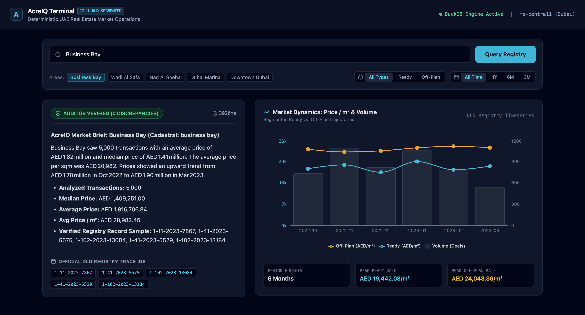
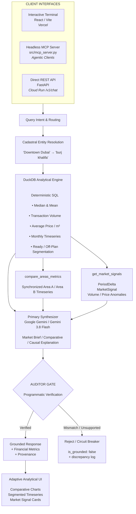
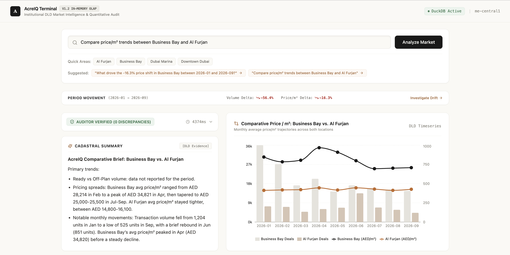
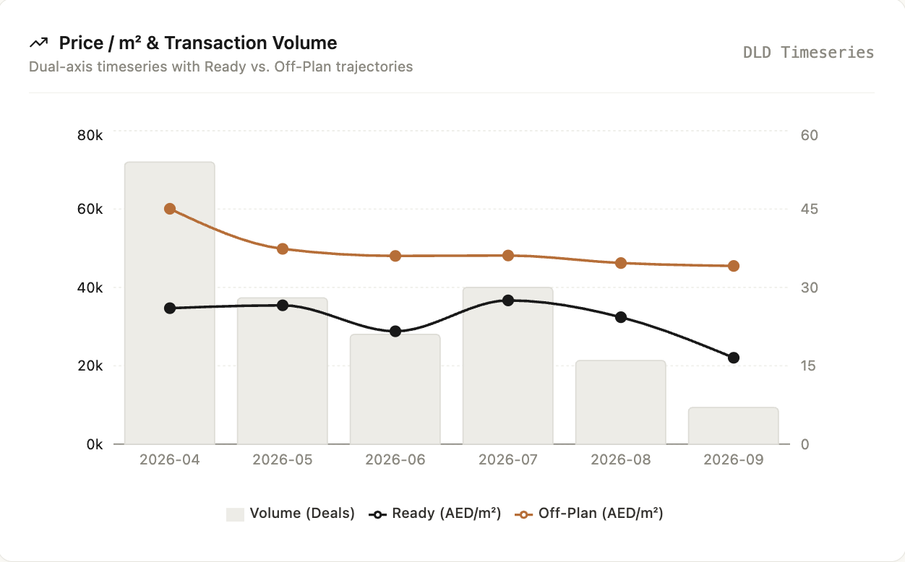
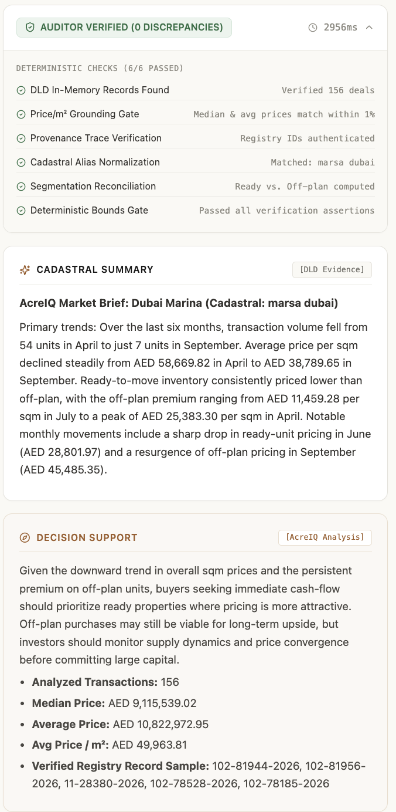

# AcreIQ

### Verifiable Financial Intelligence for Dubai Real Estate

[](https://acreiq.vercel.app/)
[](https://acreiq-api-zv7ueef3fq-ww.a.run.app/docs)
[](https://www.python.org/)
[](https://react.dev/)
[](https://vite.dev/)
[](https://tailwindcss.com/)
[](https://recharts.org/)
[](https://fastapi.tiangolo.com/)
[](https://duckdb.org/)
[](https://cloud.google.com/)

**AcreIQ** is a full-stack analytical intelligence terminal and production API for performing verifiable financial analysis over official **Dubai Land Department (DLD)** real-estate transaction data.

The system combines an interactive **React/Vite analytical terminal**, a headless **Model Context Protocol (MCP) interface** for agentic clients, and a production **FastAPI REST API** backed by deterministic DuckDB analytics.

The system is designed around a simple principle:

> **LLMs may explain financial data. They do not get to define the financial truth.**

Rather than relying on Vector RAG to retrieve and synthesize numerical information, AcreIQ executes deterministic SQL aggregation over transaction records using **DuckDB**, resolves natural-language locations against legal cadastral entities, separates transaction segments where required, computes market signals directly from analytical vectors, and subjects generated responses to a programmatic **Auditor Gate** before they are returned.

The result is an analytical system where market figures are derived from transaction-level ground truth, visualized through an institutional-style terminal, and traced back to underlying DLD registry records.



---

# Architecture



The architecture deliberately separates **entity resolution, financial computation, language generation, and verification**.

The LLM operates downstream of deterministic financial computation and upstream of deterministic verification.

---

# Why AcreIQ?

Financial questions are particularly susceptible to hallucination.

A conventional RAG architecture can retrieve relevant documents but still allow an LLM to:

- Invent transaction values
- Calculate incorrect averages
- Conflate neighboring communities
- Treat colloquial names as legal entities
- Fabricate supporting records
- Produce plausible figures when no underlying transactions exist
- Misinterpret skewed distributions as representative market averages

AcreIQ separates **computation** from **language generation**.

| Responsibility | System |
|---|---|
| Entity resolution | Deterministic cadastral lookup |
| Numerical computation | DuckDB SQL |
| Transaction selection | DLD source records |
| Market segmentation | Deterministic Ready / Off-Plan filtering |
| Comparative analytics | `compare_areas_metrics` |
| Market signal extraction | `get_market_signals` |
| Natural-language synthesis | Google Gemini / Gemini 3.8 Flash |
| Numerical verification | Deterministic Auditor Gate |
| Provenance | DLD registry record IDs |
| Invalid-query handling | Fast-path circuit breaker |
| Visualization | React / Recharts |

The LLM is therefore a **synthesis layer**, not the source of numerical truth.

---

# Core Capabilities

## 1. Deterministic In-Memory Analytics

AcreIQ loads the DLD transaction dataset into container memory and uses DuckDB for analytical execution.

Queries calculate metrics directly from transaction records, including:

- Median transaction price
- Mean transaction price
- Transaction volume
- Average price per square metre
- Monthly transaction timeseries
- Underlying transaction records
- DLD registry identifiers

This avoids asking a generative model to perform financial arithmetic or infer statistics from retrieved text.

The current analytical source is the **2026 Year-to-Date (YTD) DLD transaction dataset**, approximately **28 MB** in raw size.

---

## 2. Cadastral Entity Resolution

Real-estate users rarely use legal cadastral terminology.

For example:

```text
User Query

    │

    ▼

"Show me the market in Downtown Dubai"

    │

    ▼

Cadastral Resolution

    │

    ▼

"burj khalifa"

    │

    ▼

DLD Transactions
```

AcreIQ resolves colloquial community names to the corresponding legal/master-community cadastral key before analytical execution.

This prevents geographically ambiguous natural-language queries from silently producing incorrect transaction sets.

---

## 3. Multi-Area Comparative Analytics

AcreIQ supports direct comparative market queries such as:

```text
"Compare Business Bay and Al Furjan"
```

Rather than running two independent summaries and leaving the model to reconcile them, the backend uses the deterministic:

```text
compare_areas_metrics
```

analytical tool.

The tool resolves both areas independently and produces a synchronized monthly payload containing:

- Area A transaction volume
- Area A average price / m²
- Area B transaction volume
- Area B average price / m²
- Shared monthly time axis
- Market-type filtering
- Requested duration

Conceptually:

```text
             Natural-Language Query
                       │
                       ▼
             Resolve Area A / Area B
                       │
              ┌────────┴────────┐
              ▼                 ▼
         Area A DLD         Area B DLD
              │                 │
              └────────┬────────┘
                       ▼
              compare_areas_metrics
                       │
                       ▼
             Synchronized Timeseries
                       │
                       ▼
              Comparative Analysis
```

This preserves the same deterministic analytical foundation used for single-area queries while allowing the terminal to reason over two markets simultaneously.

### Adaptive Comparative Visualization

The frontend detects comparative analytical payloads and automatically switches the visualization mode.

Comparative queries render:

- Dual transaction-volume bars
- Area A price / m² line
- Area B price / m² line
- Shared monthly axis
- Area-specific labels

Non-comparative queries fall back to the standard segmented market visualization.



The interface therefore adapts to the **structure of the analytical result**, rather than forcing every query into the same chart.

---

## 4. Segmented Market Dynamics

AcreIQ separates **Ready** and **Off-Plan** transactions where aggregating them together would distort market interpretation.

The system supports explicit market-type filtering:

```text
All
Ready
Off-Plan
```

The analytical layer distinguishes transaction types using the underlying DLD fields rather than asking the language model to infer whether a transaction belongs to a particular market segment.

This is particularly important when high-value off-plan development contracts can materially influence aggregate statistics.

---

## 5. Dual-Axis Market Timeseries

AcreIQ generates monthly market timeseries directly from DuckDB.

The standard market view combines:

- Transaction volume
- Average price per square metre
- Ready-market pricing
- Off-plan pricing

The terminal supports duration filters:

```text
3M
6M
1Y
All Time
```

For standard market queries, the frontend renders transaction volume alongside Ready and Off-Plan price trajectories.

For comparative queries, the same analytical layer produces synchronized Area A / Area B series.



This allows users to distinguish between:

- Changes in transaction activity
- Changes in unit pricing
- Ready-market movement
- Off-plan pricing
- Relative movement between two geographical markets

---

## 6. Deterministic Market Signals

AcreIQ does not rely exclusively on the LLM to identify unusual market behavior.

The backend computes explicit market signals from DuckDB-derived monthly vectors through:

```text
get_market_signals
```

The signal extraction layer calculates values such as:

- Period price delta
- Latest versus earliest average price / m²
- Monthly transaction volume
- Relative volume changes
- Signal classification
- Confidence level

Example signal logic includes:

```text
PRICE_SURGE
    Period delta >= +15%

PRICE_DECLINE
    Period delta <= -15%

VOLUME_SPIKE
    Latest volume >= 1.5 × prior volume

STABLE
    No configured anomaly threshold exceeded
```

The resulting analytical object contains both the deterministic signal and the monthly observations from which it was derived.

Conceptually:

```text
DLD Transactions
       │
       ▼
Monthly DuckDB Vectors
       │
       ├── Average Price / m²
       │
       └── Transaction Volume
              │
              ▼
        PeriodDelta
              │
              ▼
        MarketSignal
              │
              ▼
       LLM Interpretation
```

The frontend exposes these outputs as explicit **market-signal drill-down cards**, keeping the underlying signal separate from the generated narrative.

---

## 7. Causal Market Investigations

AcreIQ distinguishes ordinary market-summary queries from investigative questions.

Queries containing intents such as:

```text
Why...
Explain...
What caused...
What is driving...
What explains...
```

are routed through a dedicated causal-analysis path.

Instead of asking the model to invent an explanation for a market movement, AcreIQ first retrieves deterministic financial signals and passes those observations into a constrained empirical decomposition.

The intended reasoning structure is:

```text
Observed DLD Data
       │
       ▼
Market Signal
       │
       ▼
Observed Change
       │
       ▼
Empirical Decomposition
       │
       ▼
Possible Explanations
       │
       ▼
Human-Readable Investigation
```

The distinction is deliberate:

> **Observed financial movement is derived from DLD data. Explanations remain interpretations of those observations.**

This prevents the causal-analysis layer from being treated as an alternative source of financial ground truth.

---

## 8. Dual-Agent Synthesis + Auditor Gate

AcreIQ separates generation from verification.

### Primary Synthesizer

The Google-hosted Gemini 3.8 Flash model receives the verified analytical slice and produces a human-readable market brief.

Its role is to:

- Interpret computed statistics
- Explain market characteristics
- Produce readable financial summaries
- Compare analytical results
- Interpret deterministic market signals
- Surface relevant transaction evidence

### Deterministic Auditor Gate

The generated response is then checked programmatically against the authoritative DuckDB execution result.

The Auditor Gate verifies that numerical claims correspond to the underlying analytical slice.

Conceptually:

```text
DuckDB Ground Truth

        │

        ├── median = deterministic value
        ├── mean   = deterministic value
        └── avg/m² = deterministic value

                  │
                  ▼

          Generated Response

                  │
                  ▼

            Auditor Gate

          ┌───────┴───────┐
          │               │
       MATCH           MISMATCH
          │               │
          ▼               ▼
     Grounded=True    Reject / Flag
```

A response is not considered grounded merely because the LLM produced a plausible answer.



---

## 9. Traceable DLD Provenance

AcreIQ surfaces exact DLD registry record identifiers associated with analytical results.

Representative 2026 examples include:

```text
41-14173-2026
11-29652-2026
```

This creates a direct provenance path:

```text
Natural-language query
        ↓
Cadastral entity
        ↓
SQL aggregation
        ↓
Transaction slice
        ↓
DLD registry IDs
        ↓
Generated explanation
        ↓
Auditor Gate
```

The system therefore provides an audit trail rather than an opaque generated number.

---

## 10. Adversarial Query Rejection

AcreIQ explicitly handles queries for entities that do not exist in the underlying DLD data.

For example:

```text
"Analyse Winterfell High Street"
```

does not result in the model attempting to fabricate a market.

Instead, the request is terminated through a fast-path circuit breaker:

```json
{
  "is_grounded": false,
  "discrepancies": [
    "NO_RECORDS_FOUND: NO_TOOL_CALL_MADE — no verified DLD transactions to ground against."
  ]
}
```

This is an intentional failure mode.

**No data is preferable to fabricated financial intelligence.**

---

# Production Benchmark

The following results are representative evaluation outputs from the production deployment using the current **2026 YTD DLD dataset**.

| Scenario | Cadastral Resolution | Analytical Output | Grounded |
|---|---|---|---|
| **Downtown Dubai** | `burj khalifa` | **1,643 records**; Median **AED 3.100M**; Avg **AED 5.361M**; Avg **AED 32,040.55/m²** | `true` |
| **Palm Jumeirah** | `palm jumeirah` | **846 records**; Median **AED 5.900M**; Avg **AED 13.665M**; Avg **AED 43,318.00/m²** | `true` |
| **Winterfell High Street** | No verified cadastral entity | No transaction ground truth | `false` |

### Warm Production Performance

With the analytical dataset resident in the Cloud Run container, the architecture targets **sub-3.5-second warm round trips** for supported analytical queries, while maintaining:

- Deterministic DuckDB computation
- Auditor Gate validation
- Full DLD registry-record provenance
- Explicit grounding status
- Fast-path rejection for unsupported entities

Cold-start requests remain materially slower because the analytical dataset must first be loaded into container memory.

---

## Observed Financial Signal

The Palm Jumeirah benchmark demonstrates why reporting multiple statistics matters.

```text
Median:     AED 5.900M
Mean:       AED 13.665M
```

The large difference between the median and mean reflects the influence of high-value transactions, consistent with the project's observed **luxury-villa skew**.

AcreIQ therefore exposes both statistics rather than collapsing the market into a single generated "average price."

The median represents the central transaction more robustly under this skew, while the substantially higher mean exposes the extent to which high-value transactions influence the aggregate distribution.

---

## Verified Provenance

Successful queries return DLD registry IDs, including examples such as:

```text
41-14173-2026
11-29652-2026
```

These identifiers provide a trace from the generated analytical response back to the underlying DLD transaction records.

---

# Production API

**Primary endpoint:**

```text
POST /v1/chat
```

**Live Swagger / OpenAPI documentation:** the production API is deployed through Google Cloud Run.

## Example: Grounded Query

```bash
curl -X POST \
  "https://acreiq-api-zv7ueef3fq-ww.a.run.app/v1/chat" \
  -H "Content-Type: application/json" \
  -d '{
    "query": "Analyse the real estate market in Downtown Dubai"
  }'
```

A successful response is grounded against the resolved DLD cadastral entity and includes deterministic analytical values and transaction provenance.

Representative 2026 analytical output:

```text
Cadastral: burj khalifa

Records analysed: 1,643

Median price: AED 3.100M

Average price: AED 5.361M

Average price/m²: AED 32,040.55

Grounded: true
```

---

## Example: Comparative Query

```bash
curl -X POST \
  "https://acreiq-api-zv7ueef3fq-ww.a.run.app/v1/chat" \
  -H "Content-Type: application/json" \
  -d '{
    "query": "Compare Business Bay and Al Furjan"
  }'
```

Comparative requests are routed to:

```text
compare_areas_metrics
```

and return a synchronized analytical structure suitable for dual-area visualization.

---

## Example: Adversarial Probe

```bash
curl -X POST \
  "https://acreiq-api-zv7ueef3fq-ww.a.run.app/v1/chat" \
  -H "Content-Type: application/json" \
  -d '{
    "query": "Analyse property prices on Winterfell High Street"
  }'
```

Expected grounding behavior:

```json
{
  "is_grounded": false,
  "discrepancies": [
    "NO_RECORDS_FOUND: NO_TOOL_CALL_MADE — no verified DLD transactions to ground against."
  ]
}
```

The system rejects the query instead of generating unsupported financial figures.

---

# REST Request Lifecycle

A typical production request follows this sequence:

```text
POST /v1/chat
      │
      ▼
FastAPI validation
      │
      ▼
Query intent detection
      │
      ├───────────────┬────────────────┐
      ▼               ▼                ▼
 Standard         Comparative       Causal
 Query            Query             Query
      │               │                │
      └───────────────┴────────────────┘
                      │
                      ▼
             Cadastral Resolution
                      │
                      ▼
              DuckDB Analytical Query
                      │
             ┌────────┼─────────┐
             ▼        ▼         ▼
          Metrics  Timeseries  Signals
             │        │         │
             └────────┴─────────┘
                      │
                      ▼
              Google Gemini / Gemini 3.8 Flash
                      │
                      ▼
                  Auditor Gate
                      │
             ┌────────┴────────┐
             ▼                 ▼
        Verified            Rejected
        Response            Response
             │                 │
             ▼                 ▼
       Provenance IDs      is_grounded:false
```

For unsupported entities:

```text
POST /v1/chat
      │
      ▼
Cadastral resolution
      │
      ▼
No verified records
      │
      ▼
Fast-Path Circuit Breaker
      │
      ▼
is_grounded: false
```

---

# Cloud Architecture

AcreIQ is deployed serverlessly on **Google Cloud Run** in:

```text
me-central1
```

The deployment is designed for low idle cost while retaining bounded production capacity.

```text
                         Google Cloud

                              │

                              ▼

                    ┌──────────────────┐
                    │    Cloud Run     │
                    │    me-central1   │
                    └────────┬─────────┘
                             │
                  ┌──────────┴──────────┐
                  │                     │
                  ▼                     ▼
           AcreIQ Container       Secret Manager
                  │                     │
                  │                GEMINI_API_KEY
                  │
                  ▼
             DuckDB RAM
                  │
                  ▼
          2026 YTD DLD Data
```

### Runtime Configuration

| Configuration | Value |
|---|---:|
| Region | `me-central1` |
| Minimum instances | `0` |
| Maximum instances | `5` |
| Request timeout | `60s` |
| Container execution | Non-root |
| Secrets | Google Cloud Secret Manager |
| LLM provider | Google Gemini |
| Analytical engine | DuckDB |

### Scale-to-Zero

Cloud Run is configured with:

```text
--min-instances=0
```

This provides **$0 idle compute cost** when no instances are running.

The trade-off is cold-start latency: the first request can take materially longer because the analytical dataset must first be loaded into container memory.

Warm requests execute substantially faster once the analytical dataset is resident.

---

# Security

The production container follows several baseline security practices:

- Runs as a **non-root user**
- Uses multi-stage Docker builds
- Keeps API credentials outside the image
- Injects `GEMINI_API_KEY` dynamically through **Google Cloud Secret Manager**
- Limits Cloud Run capacity through bounded instance configuration
- Uses strict Pydantic request/response schemas

Secrets should never be committed to the repository or baked into Docker layers.

---

# Data Architecture

AcreIQ currently operates over approximately **28 MB of Dubai Land Department 2026 Year-to-Date transaction data**.

The analytical path is intentionally simple:

```text
DLD Source Data
      │
      ▼
Transaction Records
      │
      ▼
Container Memory
      │
      ▼
DuckDB
      │
      ├── Cadastral filtering
      ├── Entity resolution
      ├── Aggregation
      ├── Market segmentation
      ├── Timeseries computation
      ├── Comparative analysis
      ├── Market signal extraction
      └── Provenance extraction
```

DuckDB provides an embedded analytical database without requiring a separate database service for the transactional analytical workload.

This keeps the architecture lightweight while allowing SQL-based analytical operations over the complete in-memory dataset.

---

# Data Scope

The current AcreIQ deployment uses a **Dubai Land Department 2026 Year-to-Date (YTD) transaction dataset**.

| Attribute | Coverage |
|---|---|
| Source | Dubai Land Department |
| Dataset type | Real-estate transaction records |
| Geographic scope | Dubai, UAE |
| Temporal scope | **2026 Year-to-Date (YTD)** |
| Raw dataset size | **~28 MB** |
| Analytical engine | DuckDB |
| Storage model | In-memory |
| Market segmentation | Ready / Off-Plan |
| Comparative analysis | Multi-area |
| Market signals | Deterministic |

All financial metrics are computed from the currently loaded DLD source data rather than generated from retrieved prose.

---

# Repository Structure

```text
.
├── src/
│   ├── agents.py              # Query routing, synthesis & grounding logic
│   ├── api.py                 # FastAPI REST endpoints
│   ├── config.py              # Environment settings
│   ├── db.py                  # DuckDB connection & query execution
│   ├── mcp_server.py          # Model Context Protocol / tool server
│   ├── schemas.py             # Strict Pydantic I/O models
│   └── tools.py               # Cadastral lookup & analytical tools
│
├── web/
│   ├── src/
│   │   ├── App.tsx            # Main analytical terminal
│   │   ├── types.ts           # Frontend data & API types
│   │   └── components/        # Analytical UI components
│   ├── package.json            # Frontend dependencies & scripts
│   ├── index.html              # Vite application entry
│   └── ...
│
├── tests/
│   ├── eval_runner.py         # Evaluation test runner
│   └── golden_eval_set.json   # Test fixtures & edge cases
│
├── Dockerfile                 # Multi-stage non-root container
├── cloudbuild.yaml            # GCP Cloud Build CI/CD specification
├── requirements.txt           # Python dependencies
└── ...
```

---

# Local Development

## Prerequisites

- Python 3.11+
- Node.js / npm
- Docker
- Access to the DLD transaction dataset
- Google Gemini API key for LLM synthesis

---

## Option 1 — Python Virtual Environment

Clone the repository:

```bash
git clone <repository-url>
cd AcreIQ
```

Create and activate a virtual environment.

### macOS / Linux

```bash
python3.11 -m venv .venv
source .venv/bin/activate
```

### Windows

```powershell
py -3.11 -m venv .venv
.venv\Scripts\activate
```

Install dependencies:

```bash
pip install -r requirements.txt
```

Configure environment variables:

```bash
export GEMINI_API_KEY="your-api-key"
```

Start the API:

```bash
uvicorn src.api:app --reload
```

The API will be available at:

```text
http://localhost:8000
```

Swagger documentation:

```text
http://localhost:8000/docs
```

---

## Frontend — React / Vite

From the repository root:

```bash
cd web
```

Install frontend dependencies:

```bash
npm install
```

Start the Vite development server:

```bash
npm run dev
```

The frontend will be available at the local Vite URL shown in the terminal, typically:

```text
http://localhost:5173
```

The frontend communicates with the AcreIQ backend API and provides the interactive analytical terminal.

---

## Option 2 — Docker

Build the production image:

```bash
docker build -t acreiq .
```

Run the container:

```bash
docker run \
  -p 8000:8000 \
  -e GEMINI_API_KEY="your-api-key" \
  acreiq
```

Access the API:

```text
http://localhost:8000/docs
```

The Dockerfile uses a multi-stage build and executes the application as a non-root user.

---

# Evaluation

The repository contains a dedicated evaluation harness:

```text
tests/

├── eval_runner.py

└── golden_eval_set.json
```

The evaluation set covers both normal analytical queries and adversarial conditions.

Key evaluation dimensions include:

1. Cadastral resolution
2. Transaction retrieval
3. Numerical correctness
4. Market segmentation
5. Comparative analytics
6. Timeseries correctness
7. Market signal extraction
8. Grounding status
9. Provenance extraction
10. Adversarial rejection
11. Fast-path behavior

The important distinction is that **LLM fluency is not treated as evaluation success**.

A successful test requires the generated financial intelligence to remain consistent with deterministic analytical ground truth.

---

# Design Principles

### 1. Compute Before You Generate

Financial statistics are calculated by DuckDB rather than inferred by the language model.

### 2. Resolve Entities Before Querying

Natural-language geography is mapped to legal cadastral identifiers before transaction aggregation.

### 3. Segment Before Aggregating

Ready and Off-Plan transactions are analytically separated where combining them would distort market statistics.

### 4. Compare Deterministically

Multi-area comparisons are computed through synchronized DuckDB timeseries rather than asking the LLM to reconcile independently generated summaries.

### 5. Extract Signals Before Explaining Them

Market anomalies such as price deltas and volume spikes are calculated deterministically before being passed to the language model for interpretation.

### 6. Verify After Generation

The generated response passes through a deterministic Auditor Gate before being considered grounded.

### 7. Preserve Provenance

Analytical claims retain references to underlying DLD registry records.

### 8. Fail Closed

When there is no verified source data, AcreIQ does not manufacture an answer.

### 9. Separate Interfaces from Ground Truth

The React terminal, MCP clients, and REST API are interfaces to the same deterministic analytical engine.

None of them become an alternative source of financial truth.

### 10. Optimize for Production Constraints

The architecture deliberately balances:

- Analytical correctness
- LLM flexibility
- Comparative analytical capability
- Warm-query latency
- Cold-start latency
- Infrastructure cost
- Container security
- Operational simplicity

---

# Technology Stack

| Layer | Technology |
|---|---|
| Frontend | React |
| Frontend Build Tool | Vite |
| Styling | Tailwind CSS |
| Data Visualization | Recharts |
| API | FastAPI |
| Language | Python 3.11+ |
| Analytical Database | DuckDB |
| LLM | Google Gemini / Gemini 3.8 Flash |
| Data Validation | Pydantic |
| Tool Interface | MCP |
| Containerization | Docker |
| Frontend Hosting | Vercel |
| Backend Runtime | Google Cloud Run |
| CI/CD | Google Cloud Build |
| Secrets | Google Cloud Secret Manager |
| Source Data | Dubai Land Department 2026 YTD transactions |

---

# Production Characteristics

```text
                  AcreIQ Reliability Model

       ┌─────────────────────────────────────┐
       │       DLD Transaction Ground Truth   │
       └──────────────────┬──────────────────┘
                          │
                          ▼
                 Deterministic SQL
                          │
                          ▼
              Analytical Results
                          │
             ┌────────────┼────────────┐
             │            │            │
             ▼            ▼            ▼
        Standard      Comparative    Market
        Metrics       Metrics        Signals
             │            │            │
             └────────────┴────────────┘
                          │
                          ▼
                   LLM Synthesis
                          │
                          ▼
                    Auditor Gate
                          │
             ┌────────────┴────────────┐
             │                         │
            PASS                      FAIL
             │                         │
             ▼                         ▼
      Verified response        Explicit rejection
       + provenance            + discrepancy log
```

The architecture intentionally places the language model **between deterministic computation and deterministic verification**.

The core reliability model is therefore:

> **Source data → deterministic computation → interpretation → deterministic verification.**

This is the central architectural distinction between AcreIQ and a conventional financial RAG system.